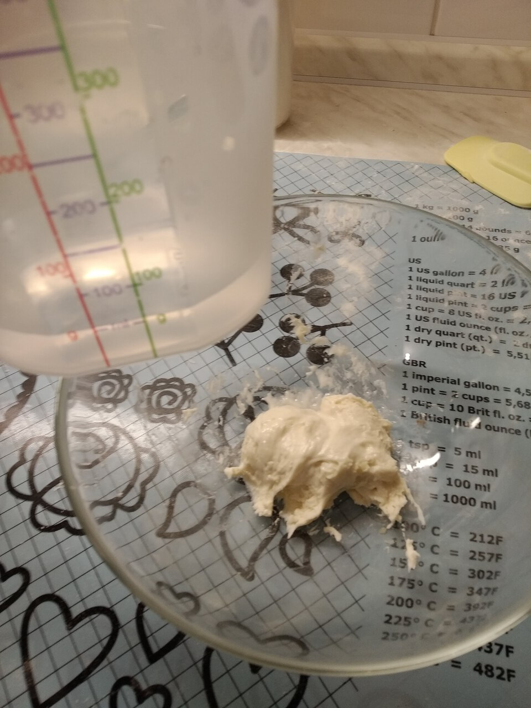
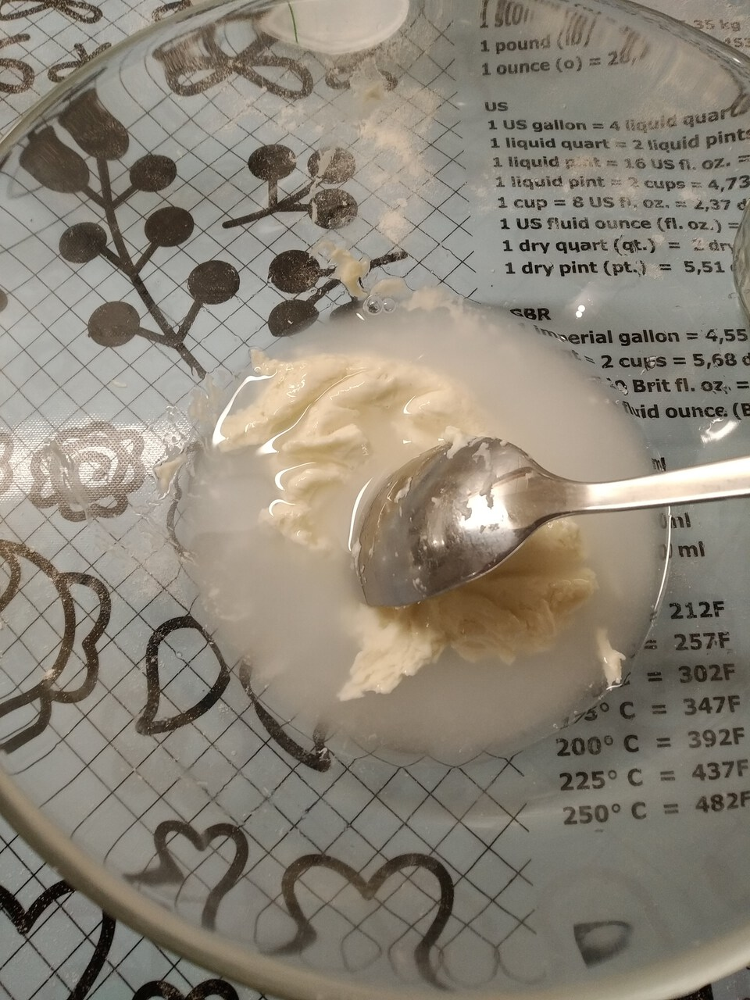
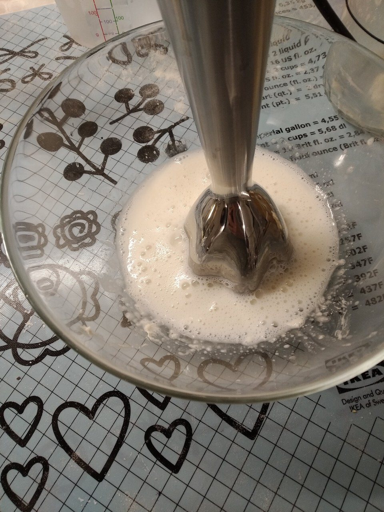
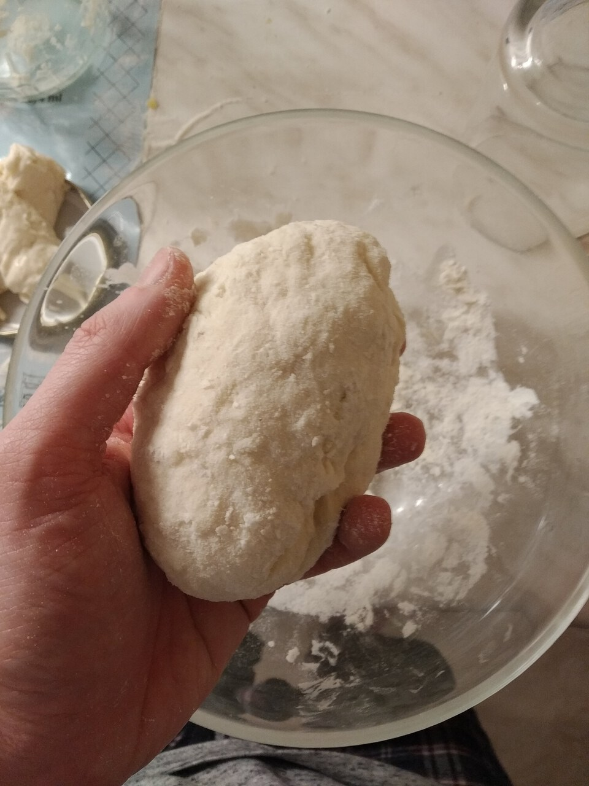

#### Table of Contents

# Kvások

Kvások je kulúra kvasiniek, ktoré pretvárajú svoje živiny (múka/cukor, voda)
na CO2, kyseliny a svoje množenie. Kvasinky teda premieňajú lepok v múke.

Rýchlosť procesu kysnutia (fermentácie, kvasenia) záleží od toho ako veľmi vyhovuje prostredie
kvasinkám. Čím nižšia teplota tým pomalšie kvasia. Pozor pri teplotách nad 35°C
začínajú umierať. V chladničke pri 5°C je asi tretinová rýchlosť množenia oproti
izbovej teplote 23°C. Optimálna teplota je vraj okolo 30°C.

Rýchosť kysnutia záleží aj na vlhkosti a dostupnosti potravy.

## Množenie / Kŕmenie / Refreshment

Pomer v akom sa kvások množí určuje to aký "druh" kvásku to je,
akú má kvasok chuť, či je viac kyslý alebo trpký.
Toto je spôsobené tým, že kvások obsahuje viacero kultúr a podla toho ako vlhko,
koľko proteínu má múka a podobne bude úspešnejšia niektorá z nich.

**Ingrediencie:**

- kvások (3)
- múka (3)
- voda (1)

Kvások ktorý máte je **Lievito madre**, ktorý používa **33% hydratáciu** pri množení.

**Postup:**

<!--

 -->

Odoberieme kvások do misky, pridáme vodu a rozmixujeme (vidličkou alebo tyčovým mixérom).

Pridáme múku a urobíme "cesto". Malo by byť nelepivé, nemusí byť hladké.

<!--  -->

Vytvarujeme guličku. Ak chceme môžeme jemne potrieť olejom.

Vložíme do pohára a ak chceme možeme narezať vrch do X.

Ako často množiť (príklad):

| Teplota uchovávania | Ako často kŕmiť |
| ------------------- | --------------- |
| 35°C                | denne           |
| 20°C                | každé 2 dni     |
| 5°C                 | týždenne        |
| -5°C                | mesiace         |

## Rozkvas / Štartér

Pred tým ako použijete kvások, väčšina receptov vyžaduje nejaký rozkvas,
aby sa kvások aktivoval, rýchlejšie pracoval, a bol rovnomernejšie rozložený
v ceste.

**Ingrediencie:**

- kvások
- múka (druh z receptu)
- voda (alebo iná tekutina)

Pomer múky a vody na rozkvas je často v recepte, najbežnejšie je to 1:1,
teda **100% hydratacia**.

**Postup:**
(viď množenie)
Rozmixovať s vodou, pridať múku. Nechať na izbovej teplote 6-12h.
Keď je hotový, mal by mať v sebe (a možno aj na vrchu) bublinky, byť vláčny a "ľahký"

## Práca s cestom

Cestá z kvásku bývajú vačšinou pevné a tým pádom sa do nich ťažko pridáva tekutina keď už dostanú cestovú konzistenciu. jednoduchšie je pridať múku.

Miesenie cesta je proces pri ktorom prekladáme, naťahujeme a stláčame cesto. 
Miesenie rukou je vhodné hlavne keď chceme "doladiť" množstvo múky - iba postupne pridávame múku na dosku alebo cesto a keď má cesto dosť múky zvyšok
zhrnieme na bok.

[Ako miesiť cesto na chlieb (nelkafood)](https://www.youtube.com/watch?v=jxKBDeSTIQc)

*Nedokázané tvrdenia:* Vďaka mieseniu sa naťahujú štruktúry múky z ktorých sa vytláča škrob(?) a cesto sa stáva pružnejšie, tuhšie a podobne. Niektorý vedci
tvrdia, že miesenie iba zhorieva cesto a inak je zbytočné. 

Podobný efekt so spracovaním múky má aj proces kvasenia.

Taktiež tento proces prebieha chemicky keď je múka vystavená vlhkosti. Preto sa niekedy cesto dáva
do chladničky na dlhší čas (napr. 8h)

Okrem vody sa niekedy dávajú do cesta aj tuky. Tuk (vraj) robí reťazce lepku
kratšie (zabraňuje vzniku dlhých pospájaných reťazcov), preto sa po anglicky tuky pridávane do cesta niekedy nazývajú "shortening".

## Recepty

### "Socialisticke" rožky

https://kvaskovanie.sk/socialisticke-rozky/

**Ingrediencie:**

rozkvas

- 200g hladka muka
- 200g voda
- 2PL kvasok

cesto

- 350g hladkej muky
- 150g polohrubej muky
- 150g mlieka
- 50g masla
- 30g bravcovej masti (/hera)
- 2 vajecne zltka
- 2-3 lyzicky soli
- 2 lyzicky ""sladenky"" (alebo medu)

**Postup:**

rozkvas 6-12h (bublinky, dvojnasobok,...) izbova teplota

zmiesame vsetko ostatne, kym nie je hladke nelepive cesto

kysnutie 4-6h (do zdvojnasobenia) izbova teplota

rozdelit na 12ks cca 100g, gulicky premiesime, nechame kysnut 15min

valcekom rozvalkat na trojuholnik, zrolovat do rozku, polozit na papier na pecenie

kysnutie 2-4h (do zdvojnasobenia)

plech nechame zohriat v trube na 225°C, na ten prenesieme papier na pecenie s rozkami

po zohriati truby, rozky poprasime vodou, vlozime do rury,
pecieme na 225°C 5min, znizime teplotu na 190°C 7-10min

prenesieme na mriezku, prekryjeme utierkou

(vsetky kvasenia su prekryte foliou alebo pod.)

### Pizza

https://www.zosrdcadohrnca.sk/2018/05/07/kvaskova-pizza/

**Ingrediencie:**

rozkvas

- 100g kvasku (2PL)
- 100g muky
- 80ml vody

cesto

- 150g rozkvasu
- 500g muky
- 300ml vody
- 2-3PL oleja
- 12g soli

**Postup:**

rozkvas 6-9h

cesto 15min v robotovi, 10-12h v chladnicke + 3-4h izbova teplota

rozdelit na 4 casti

pecenie podla teploty a truby cca 6-14min

### Kvaskovy chlieb ("KOVID")

https://kvaskovanie.sk/chlieb-kovid/

**Ingrediencie:**

Starter

- 150 g pšeničnej múky (hladkej alebo polohrubej)
- 150 g vody
- 1 PL materského kvásku

Cesto

- 300 g pšeničnej múky (hladkej alebo polohrubej)
- 2 PL krupice (nie je nutná, ale cestu len prospeje) / ak nemáme, pozri dole v postupe
- 170 g vody
- 1 uvarený a najemno nastrúhaný stredne veľký zemiak
- 2 ČL soli
- 1 ČL mletej rasce

**Postup:**

Urobime starter, nechame kvasit 9-12h pri izbovej teplote.

Pridame ostatne suroviny a urobime cesto,
nechame kvasit 2h pri izbovej teplote, po hodine trochu premiesime.

750g osatku vytrieme skrobom, vlozime cesto do osatky,
nechame kvasit 2-3h pri izbovej teplote.

Trubu vyhrejeme na 250°C aj s plechom, pecieme s parou 10 minut.

Potom odvetrame paru a znizime teplotu na 200 stupnov, pecieme 20 minut.
Chlieb musi zniet duto zo spodu

### Langose

https://nelkafood.sk/bozske-langose-z-kvasku/

**Ingrediencie:**

Rozkvas:
150g muka (hladka)
150g voda

Cesto:
850g muka (hladka)
300g voda
10g soli (2 čL)
3g sódy bikarbóny (1 čL)
250ml kysla smotana

**Postup:**

100% hydratacia rozkvas
35% hydratacia cesta + kysla smotana (mozno vynechat alebo nahradit mliekom/jogurtom)

kvasenie izbova teplota 12h (bublinky)
cesto izbova teplota 1h
cesto chladnicka cez noc
bochniky izbova teplota 1h (zdvojnasobenie)

shallow-fry 1m kazda strana

### Parene buchty

https://chutodnaty.sk/parene-buchty-2/

**Ingrediencie:**

rozkvas:

- 150g pšeničnej hrubej múky
- 140g vody
- 1 PL materského kvásku

cesto:

- 350g pšeničnej hrubej múky
- 110g mlieka
- 1 vajce
- 2 ČL sladu
- 3 PL oleja
- 1-2 ČL soli (podľa našej preferencie chuti)
- +napln

**Postup:**

rozkvas 6-12h

vsetky suroviny zmiesame (muku davat nakoniec)

cesto sa ma odliepat, byt pevne

kvasenie 2-3h, po hodine vytlacit bublinky

vyvalkat na 1cm, vykrojit kruzky/stvorce, naplnit, urobit gulicku

buchty ukladame na pomucenu dosku, prekryjeme

kvasenie 1-1.5h (130% objem)

parime 1 minutu za kazdy 1cm velkosti vykrojenia, parak potrieme olejom

po vybrati potrieme maslom aby ostali hladke

## Referencie

- https://en.wikipedia.org/wiki/Saccharomyces_cerevisiae
- https://en.wikipedia.org/wiki/Baker%27s_yeast
- https://staffoflife.wordpress.com/natural-yeast-lievito-naturale/
- https://www.weekendbakery.com/posts/favorite-flatbreads-sourdough-pita/
- https://www.butterforall.com/traditional-cooking-traditional-living/real-sourdough-pita-bread/
- https://www.baking-sense.com/2020/02/18/sourdough-pita-bread/
- http://www.theartisan.net/Direct_Sponge_and_Biga.htm
- https://www.baking-sense.com/2019/10/03/sourdough-sandwich-bread/
- https://www.baking-sense.com/2019/02/14/sourdough-english-muffins/
- https://www.theclevercarrot.com/2019/03/sourdough-baking-glossary/
- https://slice.seriouseats.com/2011/06/the-pizza-lab-on-flour-foams-and-dough.html
- https://physicsworld.com/a/the-physics-of-bread/
- https://www.youtube.com/watch?v=2FVfJTGpXnU
- https://nelkafood.sk/
- https://kvaskovanie.sk/
- https://chutodnaty.sk/
- https://www.zosrdcadohrnca.sk/
